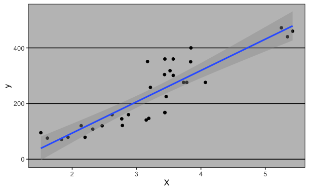

# (PART) II-Regressions{-}
# La régression linéaire simple{#simple-lm}
## Introduction
{.cover width=300}
La régression linéaire simple est une méthode statistique permettant de trouver une relation linéaire entre une variable explicative $X$ et une variable à expliquer $y$. Ce modèle consiste à considérer $y$ comme une fonction affine  de $X$. En d’autre terme, la régression linéaire a pour but de trouver une droite ajustée au nuage de points de $y$ en fonction de $X$.  
Dans ce chapitres nous allons voir en détail le modèle linéaire simple ainsi que son application avec R.
Nous utiliserons les données de [income](https://github.com/AODiakite/r4econometrics/blob/master/Data/income.data.csv)  disponible sur github. Vous pouvez télécharger le jeux de données avec la fonction `read_csv()` disponible dans le package `readr` comme suit : 
```{r,eval=FALSE}
library(readr)
income = read_csv("https://github.com/AODiakite/r4econometrics/blob/master/Data/income.data.csv")
```

```{r message=FALSE, warning=FALSE,echo=FALSE}
library(readr)
income <- read_csv("Data/income.data.csv", 
    col_types = cols(...1 = col_skip()))
```

```{r,echo=FALSE}
knitr::kable(
  x = income[1:10,], booktabs = TRUE,
  caption = "Données pour la régression linéaire simple : income( niveau de revenu par 10 000$ ), happiness(score du bonheur entre 0 et 10), nombre d’observations(498)"
)
```


## Modélisation mathématique

L’ajuste affine de $y$ par $X$ stipule que que y peut s’écrire comme équation d’une droite : 
\begin{equation}
y = \beta_0 + \beta_1 X
(\#eq:lm)
\end{equation} 

* $y(y_1,y_2,\dots,y_n)$ : variable à expliquer, variable dépendante, variable endogène, variable réponse  
* $X(x_1,x_2,\dots,x_n)$ : variable explicative,variable exogène, Variable régresseur  
* $\beta_0$ : l’ordonnée à l’origine  
* $\beta_1$ : la pente de la droite

En réalité sauf dans le cas d’un modèle parfait, la liaison linéaire \@ref(eq:lm) entre y et X est perturbée par un bruit $\epsilon$. l’équation du modèle devient alors :   
\begin{equation}
y = \beta_0 + \beta_1 X +\epsilon
(\#eq:lm-simple)
\end{equation} 
$$avec\; \epsilon\; un\; vecteur\; valant\; (\epsilon_1,\epsilon_2,\dots,\epsilon_n)$$