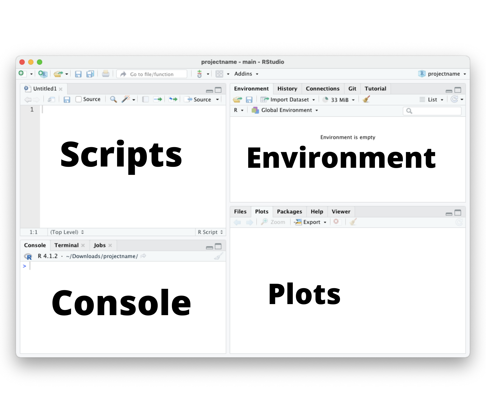

# les bases{#base}

A l’instar des autres langages, R a besoin d’un environnement de développement intégré (IDE) pour être utilisé. En plus d’une console interactive, l’IDE propose plusieurs fonctionnalités. Nous en verrons quelques-unes plus tard.  
R est intégrée par plusieurs logiciels tels que R lui-même, IntelliJ IDE, Rcode etc. Tout au long de cet ouvrage nous n’utiliserons que RStudio qui est l’un des IDE les plus célèbres de R.


## Interface{#interface}

{.cover width=300}  
L’interface RStudio se présente ainsi par défaut. Nous pouvons voir une console, un environnement de travail, une partie pour les scripts et une autre pour la visualisation des graphiques.

* La _console_ peut servir à écrire une ligne d’instruction qui sera exécutée en appuyant sur Entrer.  
* La partie dédiée au _scripts_ permet d'écrire un ensemble de lignes de codes   qui peuvent être exécutées par ordre voulu par l’utilisateur. En plus des     scripts, on peut y visualiser nos tableaux de données qui sont décrits dans   la section \@ref(dataframe).  
* Les graphes peuvent être visibles dans la partie _Plots_ de notre interface. Cette partie est un panneau contenant les onglets _Viewer_ pour les pages     html, _Files_ pour naviguer dans les fichiers, _Packages_ pour gérer les packages installes et _Help_ pour chercher de l’aide.  
* La dernière partie c’est à dire _Environment_ est consacrée à la gestion de l'environnement de travail. Elle permet de voir les variable créé lors de     notre session mais aussi d’avoir une idée sur leur structure


## Premiers codes{#firstcode}
Et si on écrivait notre premier code ?
Dans la section précédente nous avons présenté brièvement l’interface de RStudio, place maintenant à notre première instruction. Commencez par effectuer une petite opération d’addition (`2+3`) sur votre console puis appuyez sur Entrer.


```r
2+3
#> [1] 5
```
Le résultat obtenu est tout naturellement `5`. Vous constatez que `[1]` précède le résultat de l'opération, en effet l’affichage se fait par défaut sous forme d’une liste\@ref(list).  
La console peut être utilisée comme une calculatrice et supporte toute les opération arithmétique telle que la soustraction(`-`), l’addition(`+`), la multiplication(`*`), la division décimale(`/`), la division entière(`%/%`), le modulo^[modulo : Cet opérateur renvoi le reste de la division entre deux nombres] (`%%`).  
Le symbole (`#`) sert à écrire une ligne de commentaire.

```r
1+2 #addition

1-2 #Soustraction

1/2 #Division decimale

1%/%2 #Division entiere

1%%2 #Modulo

```
On peut aussi effectuer des assignations sans déclarer les variables au préalable comme l’indique le code suivant.

```r
x = 1 #affection de la valeur 1 à x
y <- 2 #affection de la valeur 2 à y
x+y #somme de x et y (1+2)
#> [1] 3
```

## Données sur R{#data-R}
Il existe 6 principaux  types simples de données sur R sont : _logical_, _integer_, _double_, _complex_, _character_, _raw_.  
Il arrive qu’une structure de données se compose de types simples données, c’est ce que nous allons étudier dans cette section.

### Vecteur 
#### Définition{-}

Le vecteur est un objet de base de R qui correspond à une liste d'éléments. Ses propriétés fondamentales sont :  

* Dimension unitaire (les vecteurs sont unidimensionnel)  
* Éléments de même type (Toutes les valeurs contenues dans un vecteur sont de même type)  
* Longueure égale au nombre d’éléments 

#### Création{-}
La fonction la plus classique pour créer un vecteur est `c(...)`. Elle prend comme argument les éléments du vecteur. Dans le code suivant, nous allons créer un vecteur contenant les valeurs de 1 jusqu’à 5 puis nous allons le nommer `myvector`

```r
myvector <- c(1,2,3,4,5) #Création
myvector #Affichage
#> [1] 1 2 3 4 5
```
Maintenant que nous avons un vecteur, il est naturel de se demander comment accéder aux éléments de ce dernier. Facile ! Il suffit de mettre entre crochet (`[]`), juste après le nom de votre vecteur, l'indice de l'élément voulu sachant que sur R le comptage commence par 1 au lieu de 0. Par exemple, dans la cellule suivante, le code permet d’afficher le quatrième élément c'est-à-dire celui qui a pour indice 4 de `myvector`. 

```r
myvector[4]
#> [1] 4
```
Vous pouvez aussi supprimer un élément d’un vecteur en essayant de l’afficher avec l’opposé de son indice. Supprimons le premier élément de `myvector` !

```r
myvector[-1]
#> [1] 2 3 4 5
```

Il se peut qu’on veuille créer une séquence de valeurs avec un pas spécifié. Un exemple concret c’est de vouloir créer un vecteur nommé `evenVector` contenant tous les nombres pairs compris entre 0 et 100. L’utilisation de la fonction `c()` rendrait le travail fastidieux. La fonction `seq()` est plus adaptée à notre situation. Elle prend comme argument fom(le début de la séquence), to(la fin de la séquence), by(le pas de la séquence), etc. Pour en savoir plus vous pouvez exécuter la commande `?seq()`.

```r
evenVector <- seq(from = 0, to = 100, by = 2) #Création 
evenVector #Affichage
#>  [1]   0   2   4   6   8  10  12  14  16  18  20  22  24  26
#> [15]  28  30  32  34  36  38  40  42  44  46  48  50  52  54
#> [29]  56  58  60  62  64  66  68  70  72  74  76  78  80  82
#> [43]  84  86  88  90  92  94  96  98 100
```

Si le pas de la séquence est de 1, on peut utiliser à la place de `seq()` l'opérateur  `:` de premier terme le début de la séquence et de second terme la fin de la séquence. L’exemple qui suit permet de créer le vecteur `myvector` contenant tous les entiers de 1 à 5. 

```r
myvector <- 1:5
myvector
#> [1] 1 2 3 4 5
```

Il est possible de créer un vecteur d'éléments répétitifs avec la fonction `rep()`. Supposons que nous voulons créer le vecteur `repvector` contenant 5 fois de suite tous les entiers de 1 à 10, nous allons donner en premier argument à la fonction `rep()` l’objet à répéter (`1:10`) et comme second argument le nombre de répétitions(`5`).

```r
repvector <- rep(1:10,5)
repvector
#>  [1]  1  2  3  4  5  6  7  8  9 10  1  2  3  4  5  6  7  8
#> [19]  9 10  1  2  3  4  5  6  7  8  9 10  1  2  3  4  5  6
#> [37]  7  8  9 10  1  2  3  4  5  6  7  8  9 10
```

### Facteur
#### Définition{-}
Le facteur (_factor_) est un vecteur de valeurs d’une variable catégorielle. Très souvevent, les variables qualitatives sont catégorielles c’est le cas du sexe(Homme, Femme), des questions directes(Oui, Non), etc.C’est d’ailleurs la raison de l’existance de cet objet sur R qui est très utiles dans certaines representations graphiques.Le caractère principal de _factor_ est qu’il dispose de niveaux appelés `levels`. Ces derniers sont uniques et peuvent avoir des valeurs qui ne sont pas contenus par le facteur.

#### Création{-}
Pour créer un facteur, on commence par créer un vecteur puis avec la fonction `factor()` nous pouvons le transformer en objet de type facteur. Par défaut, les niveaux des facteurs sont les modalités prises par le vecteur. Pour modifier les niveaux on utilise l’argument `levels` de la fonction `factor()` pour spécifier notre vecteur de niveaux. 
On se propose de transformer en facteur le vecteur `animal` de modalités _chat_, _souris_, _chien_ en un facteur de niveaux _chat_, _souris_,  _chien_ et _rat_.

```r
animal <- c("souris","souris","chien","chat","chien","chat","souris","chat","chat","chien")
myfactor <- factor(animal,levels = c('chat','souris','chien','rat'))
myfactor
#>  [1] souris souris chien  chat   chien  chat   souris chat  
#>  [9] chat   chien 
#> Levels: chat souris chien rat
```


### Liste{#list}
#### Définition{-}
Une liste est un objet pouvant contenir des éléments de tous types. L'homogénéité du type des éléments n’est pas obligatoire dans une liste c’est à dire qu'elle peut contenir des listes, des vecteurs, des matrices, des fonctions etc. On peut nommer les éléments d’une liste lors de sa création en effectuant des affections.

#### Création{-}
La création d’une liste se fait avec la fonction `list()` qui prend en argument les éléments à concaténer.

```r
mylist = list(num = c(1,2,3), char = 'character')
mylist
#> $num
#> [1] 1 2 3
#> 
#> $char
#> [1] "character"
```

On peut accéder à un  élément par son nom en utilisant le symbole `$`  (`malist$nomElement`). L'accès à l'élément `num` de `mylist` peut se faire de la manière suivante :

```r
mylist$num
#> [1] 1 2 3
```

Un autre moyen d'accéder à un élément d’une liste c’est par son indice mis entre deux crochets (`[[index]]`) juste après le nom de la liste. On peut reprendre l'accès à l'élément `num` par indexation.

```r
mylist[[1]]
#> [1] 1 2 3
```

On peut modifier l'élément `num` de mylist en lui affectant une nouvelle valeur. 

```r
mylist$num = 1:10
mylist$num
#>  [1]  1  2  3  4  5  6  7  8  9 10
```

L’ajout d’un nouvel élément dans `mylist` peut aussi se faire facilement. Si on se propose d’ajouter un élément nommé `logical` qui reçoit initialement `TRUE` on peut procéder ainsi :

```r
mylist$logical = TRUE
mylist
#> $num
#>  [1]  1  2  3  4  5  6  7  8  9 10
#> 
#> $char
#> [1] "character"
#> 
#> $logical
#> [1] TRUE
```
### Matrice
#### Définition{-}

Un matrice est un un tableau dont les colonnes sont des vecteurs de même type et de même taille. Autrement dit, la matrice est un objet de deux dimensions dont tous les éléments sont de type homogène. R ne considère pas un vecteur comme une matrice colonne ou ligne, ce sont deux types de structures différentes.

#### Création{-}
Une matrice colonne se crée avec la fonction `cbind()` et la matrice ligne par `rbind()`. Pour créer une matrice de plusieurs colonnes on utilise la fonction `matrix()`.
Vous pouvez avoir une documentation complète de ces fonctions en exécutant la commande faisant précéder d’un point d'interrogation le nom de votre fonction  ( _Exemple_ : `?cbind()`) dans votre console.

```r
#matrice colonne
colMatrix <- cbind(1:5)
colMatrix
#>      [,1]
#> [1,]    1
#> [2,]    2
#> [3,]    3
#> [4,]    4
#> [5,]    5
```

```r
#matrice ligne
rowMatrix <- rbind(1:5)
rowMatrix
#>      [,1] [,2] [,3] [,4] [,5]
#> [1,]    1    2    3    4    5
```

```r
#matrice
Matrix <- matrix(c(x= (1:5), y = rep(1,5)),nrow = 5)
Matrix
#>      [,1] [,2]
#> [1,]    1    1
#> [2,]    2    1
#> [3,]    3    1
#> [4,]    4    1
#> [5,]    5    1
```

On peut accéder aux éléments de la matrice par leurs indices. Comme on le fait en maths, il faut d’abord mettre le numéro de la ligne puis le numéro de la colonne séparée par une virgule.
On peut afficher une ligne (respectivement une colonne )toute entière en spécifiant seulement l’indice de la ligne (respectivement la colonne).

```r
# Accès à l'élément de la ligne 4 et de la colonne 1
Matrix[4,1]
#> [1] 4
```

```r
# Accès à  la ligne 2 
Matrix[2,]
#> [1] 2 1
```

```r
# Accès à la colonne 3
Matrix[,2]
#> [1] 1 1 1 1 1
```

### Tableau de données ou  Data frame{#dataframe}
#### Définition{-}

Un tableau de données (data frame) est comme la matrice, un objet de deux dimensions sauf qu’il peut contenir des colonnes de types différents. Chaque colonne doit contenir des éléments de même type. La data.frame est un objet très utilisé sur R et ce sera le cas dans les chapitres suivants de ce livre.

#### Création{-}
La fonction `data.frame()` permet de créer un un tableau de données. Elle prend en argument des vecteurs de même longueur. Il en existe d’autres arguments pour cette fonction, pour en savoir plus vous pouvez exécuter `?data.frame()`.

```r
x = c(12,67,13)
y = c('A','B','C')
tableau = data.frame(x,y)
tableau
#>    x y
#> 1 12 A
#> 2 67 B
#> 3 13 C
```

L'accès à un élément peut se faire de la même manière qu’avec les matrices. Pour accéder à une colonne par son nom on utilise le symbole `$` comme dans la section liste. Les codes suivants permettent d'accéder à l'élément “B” de `tableau` de plusieurs façons.

```r
#Indexiation
tableau[2,2]
#> [1] "B"
```

```r
#Par le nom de la colonne
tableau$y[2]
#> [1] "B"
```

```r
tableau[['y']][2]
#> [1] "B"
```

## Les boucles et conditions
### Les boucles
Les boucles permettent de gérer des instructions répétitives. Sur R il est plus pratique d’utiliser la vectorisation, mais pour débuter, les boucles feront l’affaire.

#### for{-}
La boucle for permet d’itérer sur un vecteur de longueur connu d’avance. La syntaxe est la suivante :

```r
for (variable in vector) {
  statements
}
```

Un exemple de création d'un vecteur de 5 éléments contenant les carré des nombre compris entre 1 et 5

```r
#Initialisation
carrevector = 0
#Boucle
for (i in 1:5) {
  carrevector[i]=i^2
}
#affichage
carrevector
#> [1]  1  4  9 16 25
```
#### While{-}
Si le nombre d’itérations n’est pas connu d’avance alors que la condition d'arrêt si, il est préférable d’utiliser la boucle while. Elle permet de répéter une instruction tant qu’une condition est satisfaite.  la syntaxe est la suivante : 

```r
while (condition) {
  statements
}
```
Avec la boucle while on peut chercher le premier élément supérieur à 10 dans `carrevector`. Les deux conditions d'arrêts sont alors : l'élément(`x`) supérieur à 10 et(`&`) l’indice(`j`) supérieur à la longueur du vecteur(`5`).  

```r
# Initialisation
j = 1
# Boucle
while (carrevector[j]<=10 & j<= 5){
  j=j+1
}
x=carrevector[j]
# Affichage
x
#> [1] 16
```

### Les conditions 
Elles permettent d'exécuter des instructions si une ou des conditions sont satisfaites. la syntaxe la plus simple est :

```r
if (condition) {
  #statements
}else{
  #statements
}
```
**Exemple** :  


```r
num = 10
if (num > 0) {
  print('Ce nombre est positif')
}else{
  print('Ce nombre est negatif')
}
#> [1] "Ce nombre est positif"
```

## Les fonctions
Si dans un projet vous aurez à utiliser plusieurs fois un bloc d’instructions, l'idéal c’est de créer des fonctions. Pour cela, on a besoin de `function()` que l’on assigne au nom de notre fonction. 
Les fonctions peuvent retourner une valeur ou bien exécuter seulement un ensemble d’instructions.


```r
mafonction = name <- function(arguments) {
  instructions
  return(valuer)
}
```
Pour créer la fonction `addition` qui somme deux éléments `x` et `y` on procède ainsi :

```r
addition <- function(x,y){
  return(x+y)
}
#Ou bien
addition <- function(x,y){
  x+y
}
```
Pour utiliser la fonction il suffit de l’appeler en indiquant les valeurs de ses arguments entre parenthèses.

```r
# somme de 10 et de 4
addition(10,4)
#> [1] 14
```

## Liens utils{-}
@base  
https://cran.r-project.org/doc/contrib/Paradis-rdebuts_fr.pdf
