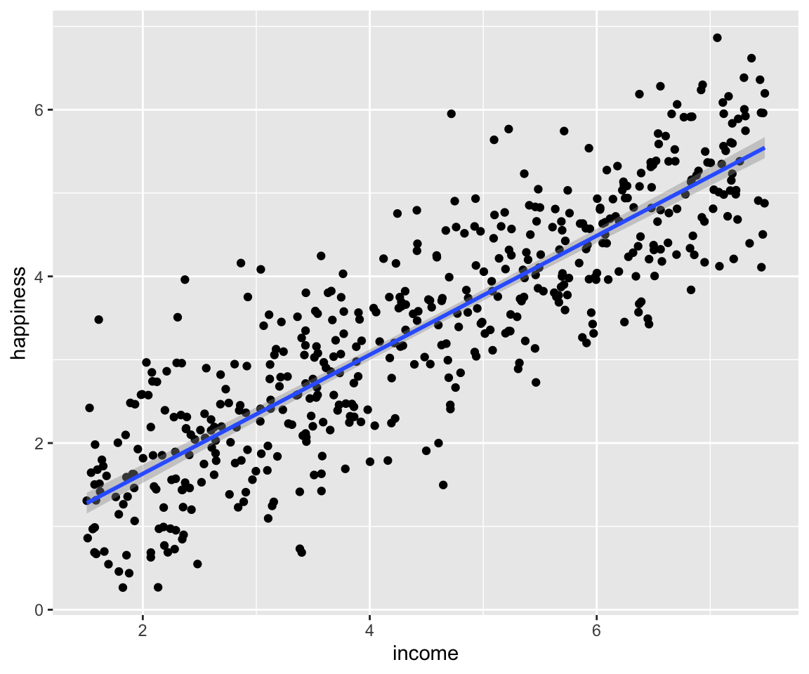
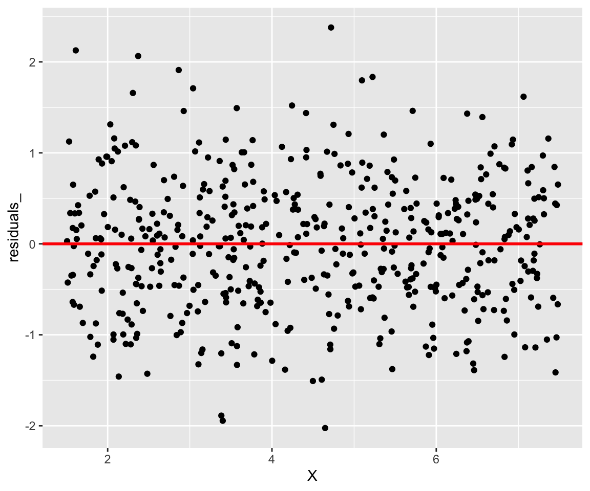
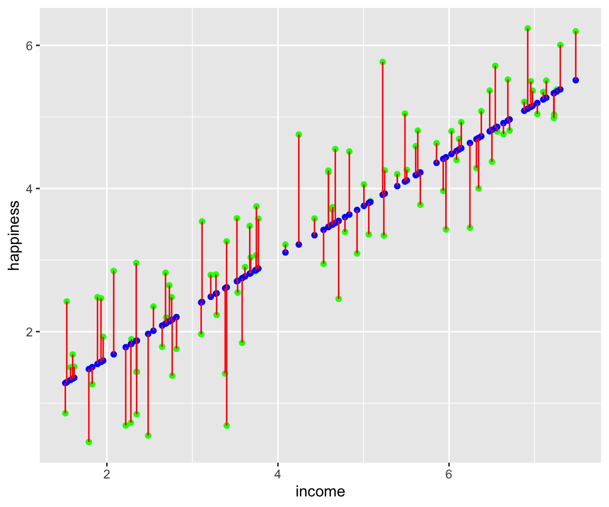

# (PART) II-Regressions {.unnumbered}

# La régression linéaire simple {#simple-lm}

## Introduction

{.cover width="300"} La régression linéaire
simple est une méthode statistique permettant de trouver une relation
linéaire entre une variable explicative $X$ et une variable à expliquer
$y$. Ce modèle consiste à considérer $y$ comme une fonction affine de
$X$. En d'autre terme, la régression linéaire a pour but de trouver une
droite ajustée au nuage de points de $y$ en fonction de $X$.  
Dans ce chapitres nous allons voir en détail le modèle linéaire simple
ainsi que son application avec R. Nous utiliserons les données de
[income](https://github.com/AODiakite/r4econometrics/blob/master/Data/income.data.csv)
disponible sur github. Vous pouvez télécharger le jeux de données avec
la fonction `read_csv()` disponible dans le package `readr` comme suit :


```r
library(readr)
income = read_csv("https://github.com/AODiakite/r4econometrics/blob/master/Data/income.data.csv")
```


Table: (\#tab:unnamed-chunk-3)Données pour la régression linéaire simple : income( niveau de revenu par 10 000 dollars ), happiness(score du bonheur entre 0 et 10), nombre d’observations(498)

|   income| happiness|
|--------:|---------:|
| 3.862647|  2.314489|
| 4.979381|  3.433490|
| 4.923957|  4.599373|
| 3.214372|  2.791114|
| 7.196409|  5.596398|
| 3.729643|  2.458556|
| 4.674517|  3.192992|
| 4.498104|  1.907137|
| 3.121631|  2.942450|
| 4.639914|  3.737942|

## Modélisation mathématique

L'ajustement affine de $y$ par $X$ stipule que $y$ peut s'écrire comme équation d'une droite :

```{=tex}
\begin{equation}
y = \beta_0 + \beta_1 X  
(\#eq:lm)
\end{equation}
```
-   $y(y_1,y_2,\dots,y_n)$ : variable à expliquer, variable dépendante,
    variable endogène, variable réponse\
-   $X(x_1,x_2,\dots,x_n)$ : variable explicative,variable exogène,
    Variable régresseur\
-   $\beta_0$ : l'ordonnée à l'origine, coefficient inconnu
-   $\beta_1$ : la pente de la droite, coefficient inconnu

En réalité sauf dans le cas d'un modèle parfait, la liaison linéaire
\@ref(eq:lm) entre y et X est perturbée par un bruit $\epsilon$.
l'équation du modèle devient alors :

```{=tex}
\begin{equation}
y = \beta_0 + \beta_1 X +\epsilon
(\#eq:lm-simple)
\end{equation}
```


La variable aléatoire $\epsilon$ est indépendante de $X$ et est supposée
suivre une loi normale de moyenne $0$ et d'écart type $\sigma$ :


$$ (\epsilon_1,\epsilon_2,\dots,\epsilon_n)= \epsilon \sim \mathcal{N}(0,\,\sigma^{2})$$

Pour le jeu de données `income` nous allons prendre comme variable
exogène $X$ les revenus des individus(`income`) et le niveau de
bonheur(`happiness`) comme variable endogène $y$. Ce choix n'est pas
hasardeux, car dans la régression linéaire, la variable indépendante
doit être déterministe c'est à un dire ne comportant pas de caractère
aléatoire alors que la variable dépendante comporte quant à elle un
bruit aléatoire $\epsilon$.\
Du fait que la moyenne de $\epsilon$ soit nulle, l'équation
\@ref(eq:lm-simple) revient juste à une estimation d'une moyenne
conditionnelle :

```{=tex}
\begin{equation}
\mathbb{E}(y_i|X_i) = \beta_0 + \beta_1 X_i
(\#eq:lm-E)
\end{equation}
```

La première étape lors d'une régression linéaire c'est la représentation
graphique du nuage de points. En effet si le nuage ne s'apparente pas à
une droite, la régression linéaire ne sera pas le meilleur modèle pour
notre jeu de données. Dans cet ouvrage nous utiliserons le package
ggplot2[^simple-lm-1] pour nos représentations graphiques.

[^simple-lm-1]: ggplot2 :
    <https://r4ds.had.co.nz/data-visualisation.html>


```r
library(ggplot2) #Chargement du package
fig1 = ggplot(data = income,aes(x =income, y = happiness)) +
               geom_point()
fig1
```

<div class="figure" style="text-align: center">

<p class="caption">(\#fig:nuage1)A première vue, ce nuage admet bien une tendance linéaire.</p>
</div>

## Estimateurs des moindres carrés ordinaires ($MCO$){#OLS}

La problématique du modèle\@ref(eq:lm-simple), c'est de trouver les
coefficients $\beta_i$ qui donnent un meilleur ajustement linéaire de
$y$. Pour cela on a recours aux estimateurs des moindres carrés.
Cette méthode consiste à trouver les coefficients qui minimise la
quantité :

```{=tex}
\begin{equation}

(\beta_0,\beta_1) = \sum\limits^{n}_{i=1}(y_i -\beta_0-\beta_1 x_i)^2=\sum\limits^{n}_{i=1}\epsilon_i^2
(\#eq:OLS)

\end{equation}
```

Les estimateurs $\hat{\beta}_i$ s'écrivent donc de la forme :

$$(\hat\beta_0,\hat\beta_1) =\operatorname*{argmin}_{(\beta_0,\beta_1)\in \mathbb{R}\times\mathbb{R}}S(\beta_0,\beta_1)$$


La fonction $S$ est strictement convexe donc si elle admet un point
singulier, celui-ci correspondra à l'unique minimum. Les estimateurs des
moindres carrés sont obtenus en résolvant le système d'équation qui
annule les dérivées partielles de $S$ aux points $\beta_i$. Le résultat
de ce système est :

$$\hat{\beta}_1 = \frac{\sum(x_i – \bar{x}) (y_i – \bar{y})} {\sum(x_i – \bar{x})^2} = \frac{Cov(X,y)}{Var(X)}$$
$$\hat{\beta}_0 = \bar{y} – \hat{\beta}_1 \bar{x}$$
$$avec\; :\; \bar{y} = \frac{1}{n}\sum\limits_{i=1}^n y_i\; et\; \bar{x} = \frac{1}{n}\sum\limits_{i=1}^n x_i $$

La fonction `lm()` permet d'entrainer un modèle linéaire sur R. Dans
notre exemple, on procède ainsi :


```r
lm_simple <- lm(formula = happiness~income, data = income)
```


```r
summary(lm_simple)
#> 
#> Call:
#> lm(formula = happiness ~ income, data = income)
#> 
#> Residuals:
#>      Min       1Q   Median       3Q      Max 
#> -2.02479 -0.48526  0.04078  0.45898  2.37805 
#> 
#> Coefficients:
#>             Estimate Std. Error t value Pr(>|t|)    
#> (Intercept)  0.20427    0.08884   2.299   0.0219 *  
#> income       0.71383    0.01854  38.505   <2e-16 ***
#> ---
#> Signif. codes:  
#> 0 '***' 0.001 '**' 0.01 '*' 0.05 '.' 0.1 ' ' 1
#> 
#> Residual standard error: 0.7181 on 496 degrees of freedom
#> Multiple R-squared:  0.7493,	Adjusted R-squared:  0.7488 
#> F-statistic:  1483 on 1 and 496 DF,  p-value: < 2.2e-16
```

La sortie précédente indique une matrice (**Coefficients**) de 5
colonnes.

-   **Estimate** : les estimations des paramètres. Dans notre exemple,
    $\beta_0 = 0.20427$ et $\beta_1 = 0.71383$.

-   **Std. Error** : les écarts-types estimés des coefficients.

-   **t value** : La valeur observée de la statistique de test
    d'hypothèses
    $\begin{cases} H_0: \beta_i = 0 \\ H_1: \beta_i \neq 0 \end{cases}$

-   **Pr(>\|t\|)** : la probabilité critique (ou « p-value ») qui est la
    probabilité, pour la statistique de test sous $H_0$, de dépasser la
    valeur estimée.

-   La dernière colonne est une indication sur le résultat des tests. Si
    elle est vide cela signifie qu'on ne peut pas rejeter l'hypothèse
    $H_0$. Par contre si elle n'est pas vide ce qu'on rejette
    l'hypothèse $H_0$ au seuil significatif correspondant au symbole
    (`***`: 0.001, `**`: 0.01, `*`: 0.05, `.`: 0.1)

Les « p-value » de notre exemple sont toutes inferieures à
$\alpha = 5\%$, on peut donc rejeter l'hypothèse nulle pour un niveau de
confiance de $95\%$.\
En plus des informations sur les coefficients, la sortie de la fonction
`summary` modèle renseigne aussi sur :

-   **Residual standard error** : l'estimation de $\sigma$ de $\epsilon$
    qui vaut $0.7181$
-   **Degrees of freedom** : le nombre de degré de liberté associe
    ($n-2 = 496$)

## Le coefficient de détermination ($R^2$)

La qualité d'un modèle dépend de combien les $\hat{y}_i$ estimés sont
proches des $y$ observés. Le coefficient de détermination est la
quantité :

$$R^2 = \frac{SCT}{SCE}$$
avec :  
$$
\underbrace{\sum\limits_{i=1}^{n}(y_{i}-\overline{y})^2}_{SCT}=\underbrace{\sum\limits_{i=1}^{n}(\hat{y}_{i}-\overline{y})^2}_{SCE}+\underbrace{\sum\limits_{j=1}^n (y_i-\hat{y_i})^2}_{SCR}
$$

où $SCT$(somme des carrés totaux), $SCR$( somme des carrés résiduels) et
$SCE$(somme des carrés expliqués).   

Ce coefficient correspond à
**Multiple R-squared** dans la sortie de la fonction
`summary(lm_simple)`.\
La qualité du modèle dépend donc de combien $R^2$ est proche de $1$.
Plus $R^2$ est proche de $1$ plus notre modèle est bon.\
Dans notre exemple le coefficient de détermination est de $0.7493$.
Sachant qu'un bon coefficient est de l'ordre de $0.85$, le nôtre est
assez faible dans ce cas.

## Représentations graphiques

### La droite de régression

Avec ggplot2, il est très simple de représenter la droite de régression
avec la fonction `geom_smooth()`. Nous allons l'ajouter à notre objet
`fig1` \@ref(fig:nuage1) en spécifiant la `methode = "lm"`.


```r
fig1 = ggplot(data = income,aes(x =income, y = happiness)) +
               geom_point() + geom_smooth(method = "lm")
fig1
#> `geom_smooth()` using formula = 'y ~ x'
```

<div class="figure" style="text-align: center">

<p class="caption">(\#fig:lm1)La droite de régression</p>
</div>

### Graphes des résidus

On peut visualiser les résidus $\hat\epsilon_i = y_i -\hat y_i$ afin de
voir leur dispersion autour de la moyenne $0$. Les résidus peuvent être
obtenu dans le modèle entrainé `lm_simple`, on y accède par
`$residuals`.


```r
X = income$income
residuals_ = lm_simple$residuals
ggplot(data = NULL) + geom_point(aes(x = X,y =residuals_)) +
  geom_abline(slope = 0, intercept = 0, color = 'red',size = 1)
```

<div class="figure">

<p class="caption">(\#fig:unnamed-chunk-6)On voit bien que nos résidus se disperse de part et d’autre de 0 </p>
</div>

On peut aussi ajouter des sagements dans la figure \@ref(fig:lm1) pour
visualiser les résidus. Nous allons choisir juste un échantillon de 50
observations.


```r
# Les indices choisis au hasard
echantillon = sample(1:498)[1:50]
# Echantillon des revenu
X_residuals = X[echantillon]
# echention du niveau de bonheur
y = income$happiness[echantillon]
# les y estimes correspondants a l'echantillon
y_hat = lm_simple$fitted.values[echantillon]

# Representation de l'echantillon 
ggplot()+ 
  # nuage de points
  geom_point(data = income,aes(x =income, y = happiness),alpha =0.4) +
  # droite de regression
  geom_smooth(data = income,aes(x =income, y = happiness), method = 'lm') +
  # echantillon de y
  geom_point(aes( x= X_residuals, y = y), color ='red', size = 2,) +
  #les erreurs
  geom_segment(aes(x = X_residuals, y = y_hat, xend = X_residuals, yend = y),color = 'red')
```

<div class="figure">

<p class="caption">(\#fig:residuals)Les segments en rouges repressentent l’écart entre les valeurs estimées et les valeurs mesurées du niveau de bonheur (happiness)</p>
</div>

## Prédiction

Le but final d'une régression c'est de prédire des variables à
expliquées sans avoir à faire des mesures. Pour une nouvelle valeur de
$X$ nous cherchons quel serait le $y$ à partir de notre modèle.
Cette prédiction peut se faire sur R avec la fonction `predict()`.\
On va reprendre notre modèle `lm_simple` sauf que cette fois-ci, nous
n'allons pas entrainer un échantillon de $100$ observations qui
représentent $20\%$ de notre jeu de données `income`.


```r
set.seed(1234) # pour fixer une racine a la fonction sample
echantillon = sample(1:498)[1:100] # indices de nos echantillons
data_train = income[-echantillon,] # data a entrainer
data_test = income[echantillon,] # data non entrainé
lm_simple = lm(data = data_train, formula = happiness~income) # entrainement du modele
```


```r
# prediction des y correspondants a notre echantillon de X
y_predict = predict(object = lm_simple, newdata = data_test[,1])
y_predict[1:10] # Affichage des 10 premiers elements 
#>        1        2        3        4        5        6 
#> 1.577312 5.114610 4.689354 4.817752 1.968143 1.504369 
#>        7        8        9       10 
#> 1.324728 3.422421 4.913247 3.493572
```

On peut visualiser la qualité de notre prédiction en représentant en
abscisse les `y_test` et en ordonnée les `y_predict`. Pour un modèle
parfait, le nuage de point doit être sur la première
bissectrice[^simple-lm-2].

[^simple-lm-2]: la première bissectrice est une droite du plan muni d'un
    repère orthonormé, caractérisée par l'équation y = x


```r
y_test = data_test$happiness
ggplot() +
  geom_point(aes(x = y_test, y = y_predict)) +
  geom_abline(slope = 1, color ='darkred')  # première bissectrice
```

<div class="figure">

<p class="caption">(\#fig:unnamed-chunk-9)Représentations des y prédits en fonctions des y observés</p>
</div>

Comme dans la figure\@ref(fig:residuals), nous pouvons représenter les
écarts entre les y prédits et les y observés sous forme de segments.


```r
x_test = data_test$income
ggplot() +
  geom_point(data =data_test,aes(income,happiness),color = 'green') +
  geom_point(aes(x = x_test, y =y_predict), color ='blue') +
  geom_segment(aes(x =x_test , 
                   y = y_test, xend = x_test, yend = y_predict),color = 'red')
```

<div class="figure">

<p class="caption">(\#fig:unnamed-chunk-10)Les segments en rouges représentent les résidus, les points verts les y non entrainés qui ont servi au test et les points rouges représentent les y prédits à partir de notre modèle.</p>
</div>

## Référence {.unnumbered}

@lm_simple
